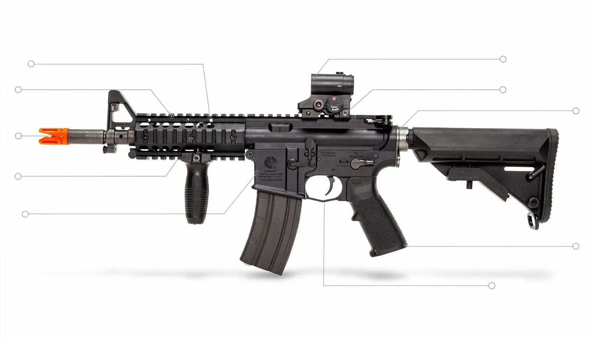
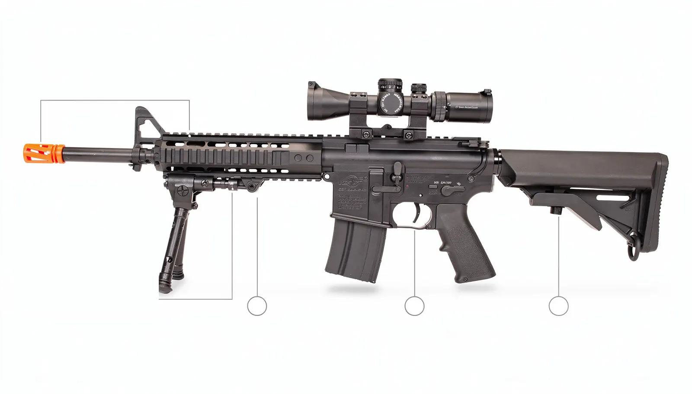
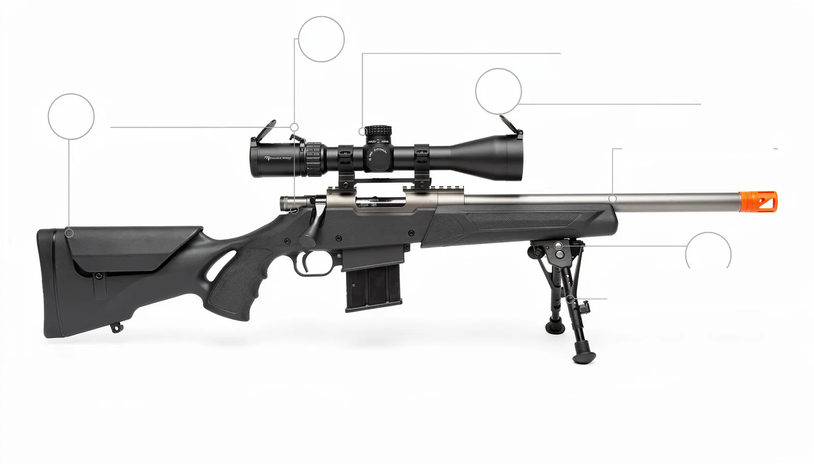

Todo mundo entra no airsoft querendo ser sniper e sai do primeiro jogo
querendo ser assalto. Não é falta de habilidade: é que cada função existe para
resolver um problema diferente dentro da partida, e escolher pela estética
custa caro.

As quatro funções abaixo não são categorias oficiais de nada — são o jeito
como o esporte se organizou na prática, e é o vocabulário que você vai ouvir
no campo.

## Assalto — a função que sustenta o jogo

É a réplica que 80% do campo está usando, e por bom motivo: funciona em tudo.

**A réplica:** AEG tipo M4, AK ou similar, cano de 10 a 16 polegadas, seletor
com automático, carregador mid-cap de 120 a 150 BBs.

- **Distância de trabalho:** 10 a 45 metros
- **FPS típico:** 350 a 400 (o limite mais comum de campo de mata)
- **Cadência:** semiautomático e automático
- **Peso:** 2,5 a 3,5 kg — dá para carregar o dia inteiro

**O que ela faz na partida:** avança, toma ponto, entra em construção, cobre
companheiro. É a única função que não depende de terreno específico nem de
outro jogador para render.

**Comece por aqui.** Não é conselho de segurança, é conselho de dinheiro: a
réplica de assalto é a que você vai continuar usando mesmo depois de comprar
outra coisa.

## DMR — precisão que não para de atirar

DMR é *Designated Marksman Rifle*. No airsoft brasileiro, é a réplica que
cobre o vão entre o assalto e o sniper.

**A réplica:** AEG com cano longo (14 a 20 polegadas), gearbox reforçado,
mola mais forte, hop-up de precisão e mira telescópica de aumento baixo.
**Trava obrigatória em semiautomático.**

- **Distância de trabalho:** 40 a 70 metros
- **FPS típico:** 400 a 450, conforme o regulamento do campo
- **Cadência:** um tiro por acionamento — e essa é a regra que autoriza o FPS
  maior
- **Distância mínima de engajamento:** quase todo campo exige (comumente 15 a
  25 metros)

**O que ela faz na partida:** segura um corredor, castiga posição fixa,
protege o avanço do time de uma distância que o assalto não alcança. E, ao
contrário do sniper, se errar o primeiro tiro pode corrigir no segundo.

**A pegadinha:** DMR sem hop-up bem regulado e sem BB pesada é só uma réplica
de assalto barulhenta e cara. Antes de subir a mola, [regule o
hop-up](/guias/hop-up-o-que-e-e-como-regular) — é o que realmente decide o
alcance útil.

## Sniper — o tiro que precisa valer

Bolt action: você atira, arma o ferrolho, atira de novo. É a função mais
romantizada e a que mais gente abandona.

**A réplica:** rifle de mola com ferrolho manual, cano de precisão, hop-up de
alta qualidade, luneta de aumento maior.

- **Distância de trabalho:** 60 a 90 metros
- **FPS típico:** 450 a 550, sempre com regra específica de campo
- **Cadência:** um tiro a cada 2 a 4 segundos, na melhor das hipóteses
- **Distância mínima de engajamento:** obrigatória e maior — comumente 25 a
  30 metros
- **Pistola secundária:** praticamente obrigatória, para quando alguém chega
  perto

**O que ela faz na partida:** ocupa um ponto de onde enxerga muito, e nega
aquele setor ao adversário. Boa parte do trabalho é chegar na posição sem ser
visto e ficar parado — às vezes por 40 minutos.

**Por que frustra:** exige camuflagem, paciência, leitura de terreno e um
campo com linha de visão longa. Em campo pequeno ou fechado, o sniper vira
peso morto. E se o adversário fura a distância mínima, você não tem resposta
além da secundária.

## Suporte — volume de fogo, não potência

Também chamada de LMG ou "metralhadora". O nome engana: ela não atira mais
forte, atira **muito mais**.

**A réplica:** AEG tipo M249, PKM ou RPK, com carregador tipo caixa (box mag)
de 1.000 a 2.500 BBs e alimentação motorizada.

- **Distância de trabalho:** 15 a 50 metros
- **FPS típico:** o mesmo do assalto — 350 a 400
- **Cadência:** automático sustentado, alta
- **Peso:** 5 a 8 kg, e é isso que separa quem gosta de quem desiste

**O que ela faz na partida:** *fogo de supressão*. Você não está tentando
acertar — está impedindo o adversário de levantar a cabeça enquanto o resto do
time flanqueia. É a função mais dependente de equipe: sozinho, um suporte só
gasta BB.

**A pegadinha:** o box mag faz barulho e a réplica é pesada. Se o seu time não
combina o flanco enquanto você suprime, o trabalho não serve para nada.

## Comparativo direto

| | Assalto | DMR | Sniper | Suporte |
|---|---|---|---|---|
| Distância | 10–45 m | 40–70 m | 60–90 m | 15–50 m |
| Cadência | auto | semi apenas | ferrolho manual | auto sustentado |
| FPS típico | 350–400 | 400–450 | 450–550 | 350–400 |
| Distância mínima | padrão do campo | maior | a maior de todas | padrão do campo |
| Peso | médio | médio-alto | médio | alto |
| Munição carregada | 300–600 | 300–600 | 100–200 | 1.000–2.500 |
| Depende do time | pouco | médio | pouco | **muito** |
| Bom para iniciante | **sim** | não | não | não |

Os números de FPS e de distância mínima são faixas de referência do que se vê
nos campos brasileiros. **Cada campo tem o seu regulamento** e ele é que vale —
confira antes de montar a réplica, principalmente para DMR e sniper.

## O erro que quase todo mundo comete

Comprar réplica de função antes de saber qual função combina com você.

DMR, sniper e suporte só rendem em condições específicas: terreno certo, time
que se comunica, regulamento que permite. Se qualquer um dos três faltar, você
carrega uma réplica cara que não faz nada — e ainda perde a partida por não
ter o que o time precisava.

O caminho barato:

1. **Jogue de assalto por alguns meses.** Descubra o que te dá prazer.
2. **Repare no que te incomoda.** Não conseguiu alcançar quem estava longe?
   DMR. Odeia correr e gosta de esperar? Sniper. Gosta de ser o que segura a
   linha? Suporte.
3. **Peça emprestado antes de comprar.** Todo campo tem alguém disposto a
   deixar você atirar um pente.
4. **Confira o regulamento do seu campo** antes de fechar a compra, sobretudo
   o limite de FPS e a distância mínima.

## Onde a réplica não decide nada

Antes de trocar de função por causa de alcance, resolva o básico: BB de
qualidade e peso certo, hop-up regulado e cano limpo mudam mais o seu alcance
do que subir de assalto para DMR.

Um assalto bem regulado com BB 0.28g acerta mais longe que um DMR mal montado
com BB 0.20g. Veja [o que é FPS](/guias/o-que-e-fps-no-airsoft) e
[qual BB usar](/guias/qual-bb-usar-no-airsoft) antes de gastar com réplica
nova — e confira o limite de FPS na ficha do [campo onde você
joga](/campos).
