Este é um catálogo visual dos padrões de camuflagem **em uso hoje no Brasil** —
Forças Armadas e polícias. Serve para reconhecer o que você vê no campo, na
notícia ou na vitrine da loja.

Não é um guia de história: os padrões aposentados (bolinhas, rana, leopardo)
ficam de fora. Se o que você quer é escolher farda para jogar, o guia é outro:
[camuflagem e vestuário no airsoft](/guias/camuflagem-e-vestuario-no-airsoft).

> **Sobre as amostras desta página.** Elas foram **desenhadas por nós** a partir
> da descrição de cada padrão — cores, geometria e proporção. São ilustrações
> para reconhecimento visual, **não fotografias do tecido oficial** nem
> reprodução exata da matriz de impressão. Servem para você bater o olho e
> dizer "é este". Para conferência técnica, vá à fonte oficial da corporação.

> ⚠️ **Este catálogo serve para RECONHECER, não para copiar.**
>
> Padrão oficial das Forças Armadas e das polícias **não é sugestão de farda
> para o seu jogo**. Usar indevidamente uniforme militar é crime tipificado no
> art. 172 do Código Penal Militar, que vale para **qualquer pessoa** — civil
> incluído —, e muitos campos hoje **barram na entrada** quem chega com padrão
> oficial. A seção [uso de farda oficial no airsoft](#uso-de-farda-oficial-no-airsoft),
> mais abaixo, explica o tamanho real do risco.
>
> Você está aqui para saber **o que é o que**. Para escolher farda, vá ao guia de
> [camuflagem e vestuário](/guias/camuflagem-e-vestuario-no-airsoft).

## A família lagarto, e por que quase tudo aqui é vertical

Antes dos padrões um a um, o traço que explica o conjunto: a camuflagem
brasileira é dominada pelo **lagarto** — faixas verticais irregulares e
ramificadas, herdadas do *lizard* francês por influência portuguesa.

Exército, Marinha e Aeronáutica usam **a mesma geometria**. O que muda de uma
força para outra é a **paleta**. Entender isso resolve metade do
reconhecimento: se as listras são verticais e ramificadas, é lagarto, e a cor
diz de quem.

A exceção moderna são os **digitais**, adotados sobretudo pelas polícias a
partir dos anos 2010, com blocos quadrados em vez de faixas.

---

## Forças Armadas

### Rajada — Exército Brasileiro

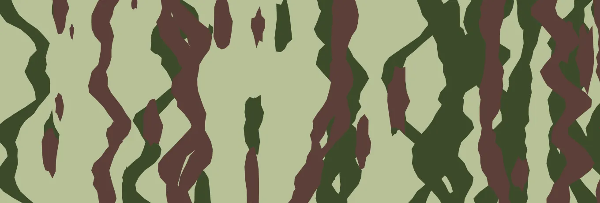

O **padrão corrente do Exército**, adotado em 1986. Listras verticais em
**verde-escuro e marrom-arroxeado sobre fundo verde-claro**.

É a camuflagem brasileira mais reconhecível e a que você mais vê em campo de
airsoft — farda de padrão semelhante é barata e fácil de achar no Brasil.

### Lagarto de 1977 — Exército Brasileiro

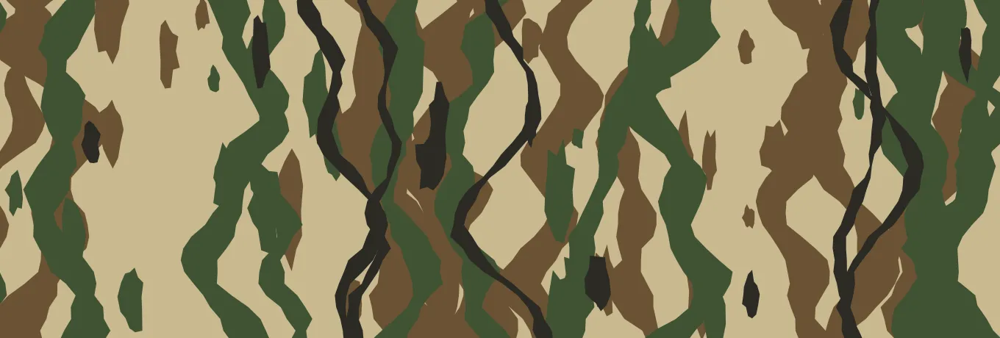

O lagarto original do Exército, de 1977, ainda em circulação. **Marrom e
verde-floresta sobre fundo areia**; a versão inicial incluía preto.

É o avô do Rajada: mesma geometria, fundo mais claro e quente.

### Caatinga — Exército Brasileiro

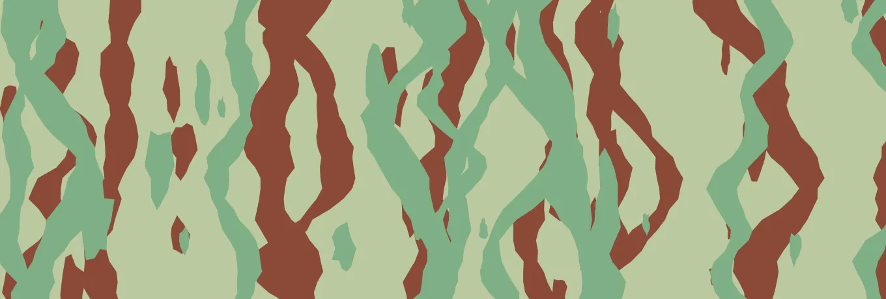

Padrão das unidades de caatinga, dos anos 1980 em diante. **Marrom-avermelhado
e verde-menta sobre fundo verde-pálido**.

A paleta responde ao semiárido: mais terra e menos verde saturado que o Rajada.

### Montanha — Exército Brasileiro

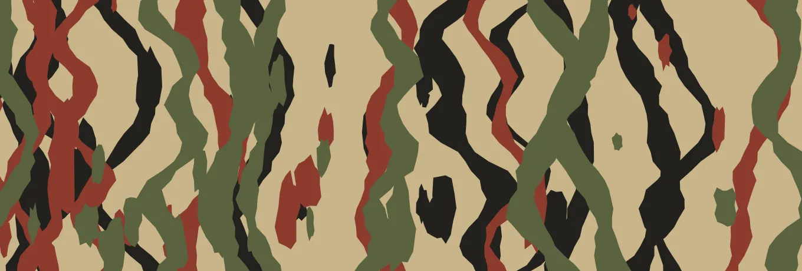

Uso restrito, em unidades de montanha, dos anos 1980 em diante. **Preto,
vermelho e verde-musgo sobre fundo areia**.

O vermelho é o traço incomum — é o padrão brasileiro mais fácil de identificar
justamente por isso.

### Lagarto — Marinha do Brasil

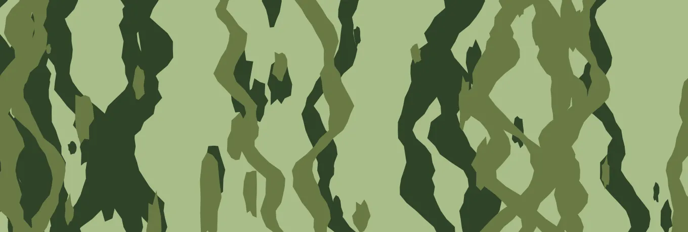

**Verde-escuro e verde-oliva sobre fundo verde-claro**. A versão contemporânea
do lagarto da Marinha, em uso desde os anos 1980.

Paleta monocromática de verdes — sem o marrom que marca o Rajada. É o jeito
mais rápido de separar os dois.

### Lagarto — Força Aérea Brasileira

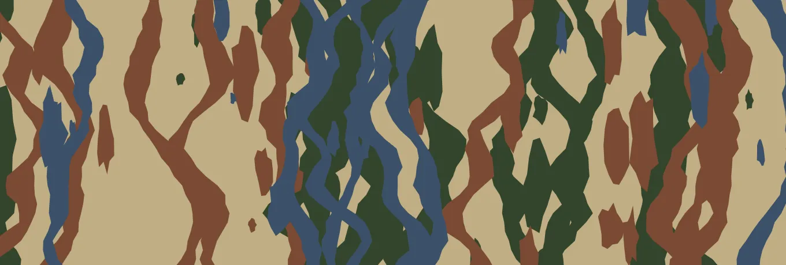

**Verde-escuro, castanho-avermelhado e azul sobre fundo cáqui**, em uso desde
os anos 1980.

O **azul** é a assinatura: nenhum outro padrão brasileiro em serviço o usa. Viu
azul no lagarto, é FAB.

### BMMCU — Corpo de Fuzileiros Navais

Adotado em 2019 para os Fuzileiros Navais, com desenho voltado a **terreno
urbano**.

**Não temos amostra desenhada deste padrão**, e é proposital: não localizamos
descrição de paleta confiável o bastante para ilustrar sem inventar. Amostra
chutada apresentada como referência é pior que amostra nenhuma.

Vale registrar, porque a sigla confunde: apesar do nome, o padrão **não é** o
Multicam norte-americano, que é desenho registrado de outra empresa.

---

## Polícias

Os padrões policiais são mais fragmentados que os militares — cada estado
decide o seu, e a rotatividade é alta. Estes são os que estão em uso.

### Lagarto urbano — batalhões de choque

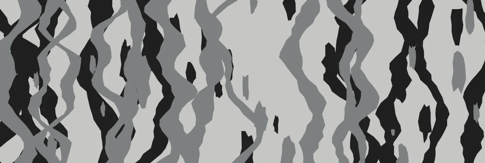

Usado por batalhões de choque, entre eles Bahia e São Paulo. **Preto e
cinza-médio sobre fundo cinza-claro**.

Mesma geometria do lagarto militar, paleta transposta para concreto.

### Lagarto vertical — Choque de São Paulo

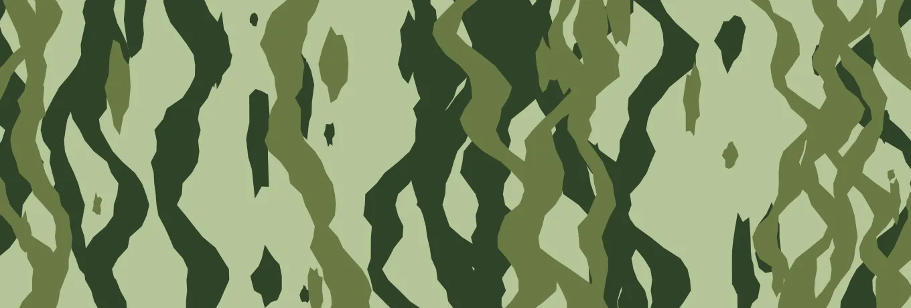

Padrão da COE do Batalhão de Choque paulista. **Verde-escuro e verde-oliva
sobre fundo verde-pálido** — muito próximo do lagarto da Marinha, com fundo
mais claro.

### Manchado urbano

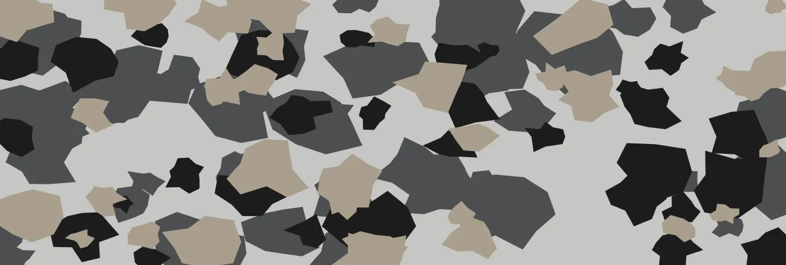

**Preto, cinza-escuro e cáqui-acinzentado sobre fundo cinza-claro**, em manchas
arredondadas — não em faixas. Registrado em unidades de Goiás, Rio Grande do
Sul e Rio de Janeiro, inclusive em missões no Timor-Leste.

É a exceção à regra vertical.

### Digital urbana — Força Nacional

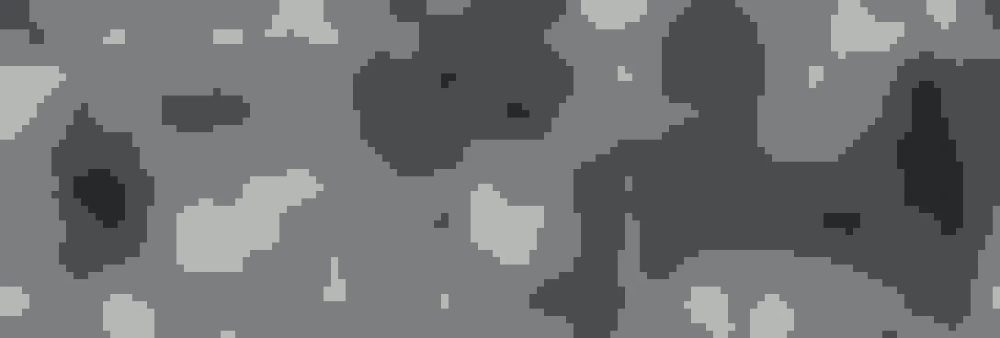

Padrão digital da Força Nacional de Segurança Pública, em tons de cinza. Existe
em mais de uma variante, uma delas com a impressão orientada na vertical.

### Digital — BOPE de Pernambuco

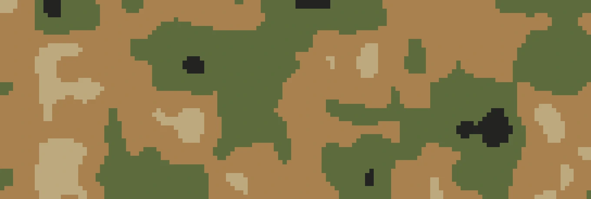

Em uso desde 2019. **Marrom-claro, verde-oliva e preto sobre fundo cáqui**.

### Digital deserto — COTAR, Ceará

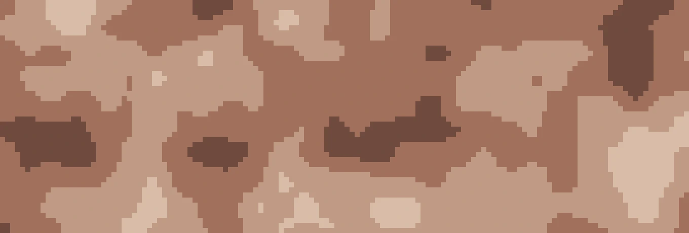

Do Comando Tático Rural cearense, desde 2018. Digital de deserto com **nuance
levemente rosada** — o detalhe que o separa dos digitais de deserto comuns.

### Digital azul — Polícia Militar de Pernambuco

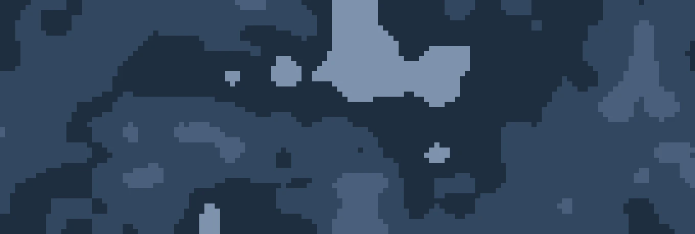

Digital em tons de azul, usado por canil, radiopatrulha e tropa de choque.

Camuflagem azul não esconde em lugar nenhum da natureza — o objetivo aqui é
**identidade visual e presença**, não ocultação. Vale lembrar disso antes de
levar para o campo esperando vantagem.

### Lagarto pixelado — polícias ambientais

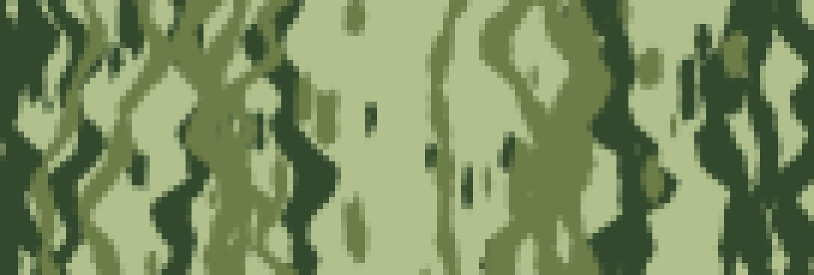

Usado por polícias ambientais, entre elas São Paulo, Amazonas e Acre — a do
Acre com tom mais arroxeado.

É literalmente o que o nome diz: a corporação pegou o lagarto que já usava e o
decompôs em blocos. Bom exemplo de como a família vertical sobreviveu à moda do
digital.

---

## Os padrões que não têm amostra aqui

Vários órgãos brasileiros usam padrões que **são propriedade de terceiros** —
desenhos comerciais registrados, licenciados ou copiados de outras forças
armadas. Nós os descrevemos, mas **não os reproduzimos**:

| Padrão | Onde aparece no Brasil |
|---|---|
| Multicam | Comando de Operações Táticas da PF, IBAMA (variante verde-escura), Batalhão do Interior de Pernambuco (variante deserto) |
| Multicam Tropic | Batalhão de Fronteira do Paraná, desde 2020 |
| A-TACS AU | Operações aéreas da Polícia Federal, desde 2012-13 |
| MARPAT (variante) | BOPE do Rio de Janeiro |
| Tiger stripe | TIGRE, Polícia Civil do Paraná |
| Seis cores deserto | BOPE do Rio de Janeiro, algumas unidades de caatinga |

Multicam, A-TACS e MARPAT são desenhos de propriedade de empresas ou de forças
armadas estrangeiras. Reproduzi-los como ilustração nossa seria copiar obra de
terceiro — a mesma razão pela qual as amostras acima foram desenhadas em vez de
baixadas.

---

## Uso de farda oficial no airsoft

Esta é a parte que mais gera discussão na comunidade, e a que mais gente erra
por achar que "todo mundo usa, então pode".

### O que a lei diz

O **art. 172 do Código Penal Militar** tipifica: *"Usar, indevidamente,
uniforme, distintivo ou insígnia militar a que não tenha direito"* — pena de
**detenção, até seis meses**. A rubrica do artigo é explícita ao dizer que vale
**por qualquer pessoa**: não é crime só de militar, alcança o civil.

Há também o **art. 46 da Lei de Contravenções Penais**, que pune usar
publicamente uniforme ou distintivo de função pública que não se exerce.

### Onde mora a controvérsia

A palavra que decide é **"indevidamente"**. A jurisprudência já entendeu que
civil de calça e camisa em padrão camuflado do Exército, **sem as demais peças
do uniforme** e sem características capazes de enganar terceiros, não comete o
crime — faltaria o potencial de confusão que o tipo penal exige.

Mas a jurisprudência é **conflitante**, e a orientação prudente de quem escreve
sobre o tema é direta: atleta de airsoft deveria **abandonar o uniforme das
Forças Armadas** e adotar vestuário alternativo, para não virar alvo de denúncia
do Ministério Público Militar.

Ou seja: dá para argumentar que padrão sem insígnia não é crime. Você só não
quer ser a pessoa fazendo esse argumento diante de um promotor.

### O que acontece na prática, hoje

Independentemente de como um juiz decidiria, **muitos organizadores já barram na
entrada** quem chega com padrão oficial das Forças Armadas ou de corporação
policial. Para o campo, é gestão de risco: um jogador fardado no estacionamento
ou no posto de gasolina da estrada vira problema para o evento inteiro.

E o risco não é maior dentro do campo — é **fora dele**. No deslocamento, no
posto, na parada para comer, é onde a abordagem acontece.

### O que fazer

1. **Prefira padrão comercial.** Existe farda de sobra em padrões que não são
   de nenhuma corporação brasileira. Resolve o problema inteiro.
2. **Nunca use insígnia, brasão, nome, posto ou distintivo de unidade real.**
   Isso é o núcleo do que a lei pune, e não tem defesa boa.
3. **Pergunte ao campo antes de ir.** A regra é do organizador, e ela vale
   mesmo onde a lei seria permissiva.
4. **Não circule fardado fora do campo.** Chegue e saia com roupa civil. É o
   conselho mais repetido por quem já se deu mal, e o mais fácil de seguir.
5. **Padrão policial merece o mesmo cuidado** — em alguns contextos, mais: ser
   confundido com policial em serviço é situação pior que ser confundido com
   militar.

> Este guia não é consultoria jurídica. A leitura acima é do texto legal e do
> debate público sobre ele; caso concreto se resolve com advogado.

## O que isso muda para o seu jogo

**Escolha pelo terreno, não pela força.** O prestígio da corporação não esconde
ninguém. Paletas verdes e escuras se saem bem em mata fechada brasileira;
terrosas levam vantagem em mata seca e cerrado; cinzas funcionam em CQB e
estrutura construída. Você consegue tudo isso em padrão comercial.

**O padrão importa menos do que você imagina.** Ficar parado, usar sombra e
quebrar a silhueta pesam mais que qualquer tecido — o
[guia de camuflagem e vestuário](/guias/camuflagem-e-vestuario-no-airsoft)
detalha isso.

**Combine com a sua equipe.** Em jogo grande, distinguir amigo de inimigo à
distância vale mais que fidelidade a qualquer padrão. Ver
[como montar o loadout](/guias/como-montar-o-loadout-de-airsoft).

---

## Fonte

O levantamento dos padrões brasileiros — quais existem, quem usa e desde
quando — foi conferido no [Camopedia](https://www.camopedia.org/index.php/Brazil),
o catálogo de referência de camuflagem militar mantido pela International
Camouflage Uniform Society. O texto e as amostras desta página são nossos; a
organização dos fatos deve muito a eles.

**Achou erro em algum padrão, ou conhece um que falta aqui?**
[Avise](/reportar) — o guia melhora com quem vê essas fardas de perto.
